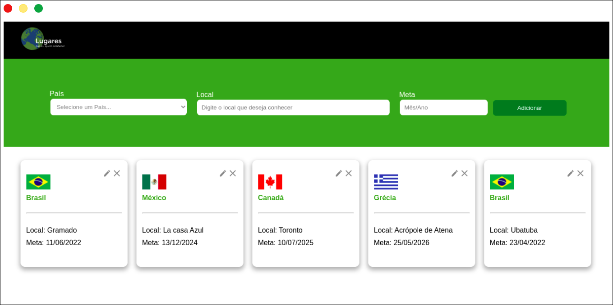

<h1 align='center'> 🗺️ Lugares</h1>

<p align='center'>'Lugares que quero conhecer', é uma plataforma onde você pode selecionar suas futuras viagens sonhadas e estipular uma meta para as fazer</p>

---



🗒️ Lista de Conteúdos 
- [Iniciando o Projeto](#Iniciando-o-Projeto)
- [Tecnologias](#Tecnologias)

#### 💻 Iniciando o Projeto
Para iniciar o projeto você deve ter o Npm ou Yarn instalado em sua maquina.
Primeiro clone e acesse o projeto 
``` 
git clone https://github.com/Brenox889/frontend-challenge.git
cd frontend-challenge
```
E então instale as dependências rodando ```npm``` ou ```yarn```.
Para iniciar o servidor use ```yarn dev``` que ira executar o seguinte comando 

```
json-server --watch data/db.json --port 8000"

```
E então use ```yarn start``` para iniciar o poder visualizar o FrontEnd


#### Tecnologias

> O projeto foi construído usando as seguintes tecnologias
- [ReactJs](https://pt-br.reactjs.org/)
- [StyledComponents](https://styled-components.com/)
- [RestCountries API](https://restcountries.com/)
- [TypeScript](https://www.typescriptlang.org/)
- [json-server](https://www.npmjs.com/package/json-server)
- [react-input-mask](https://www.npmjs.com/package/react-input-mask)

Made By [Breno Mendes](Github.com/Brenox889) :stars:
